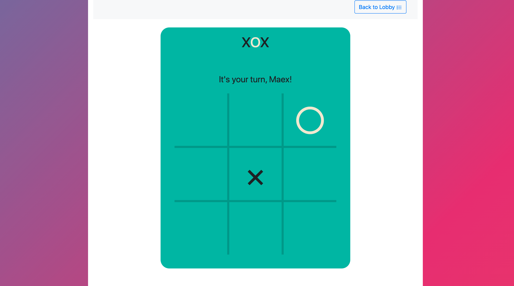

# Xox

A [Lobby-Service](https://github.com/kartoffelquadrat/LobbyService) compatible implementation of the game "*Tic Tac Toe*".



## About

This repository contains the sources of a Lobby-Service compliant sample game.  

This implementation amends the official Lobby-Service API documentation by practical interaction examples. Covered key features are:

 * Registration at the Lobby-Service during game power-up / un-registration on game shutdow.
 * Delegated user management. This game relies on the LobbyService to identify and authenticate users, via OAuth2 tokens.
 * Dynamic maintenance of parallel game sessions at runtime, accessible through a [Lobby-Service compliant REST layout](https://github.com/kartoffelquadrat/LobbyService/blob/master/markdown/game-dev.md#callbacks).
 * A self-hosted web-interface, strictly limited to game-specific functionality.


### Architecture

The game's resource layout consists of two branches: 
 * ```/xox/webui/games/{gameid}``` for a session specific interactive web-interface.
 * ```/xox/api/...``` for a RESTful API (accessed by the web-interface).


 > Credits: The web UI is based on an [existing open source implementation](https://github.com/angle943/tic-tac-toe).
 
### Deployment

This game requires a deployed instance of the [Lobby-Service](https://github.com/kartoffelquadrat/LobbyService), with enabled [Lobby-Servive Web Interface](https://github.com/kartoffelquadrat/LobbyServiceWebInterface/) to run.
It registers at the lobbyservice, using a game-*service* account.

Use one of the below deployment options to try the game:

#### BGP (Docker-compose)

This game is the default game sample module of the [BoardGamePlatform](https://github.com/kartoffelquadrat/BoardGamePlatform). Follow the BGP docker-compose instructions for a fast uncomplicated setup.  
The BGP repository also contains Dockerfiles for individual containered deployment, if needed.

#### Native

The game can be built into a standalone JAR (all compile and runtime dependencies included):  

```bash
mvn clean package -Pdev
java -jar target/xox.jar
```

 > Note: this option most likely requires adjustments in the [dev properties file](src/main/resources/application-dev.properties).

#### War

Alternatively the game can be built into a self contained *Web ARchive*

```bash
mvn clean package -Pwar
```

You can then deploy the war to a Tomcat application container.

 > Note: this option most likely requires adjustments in the [war properties file](src/main/resources/application-war.properties).

## Contact / Pull Requests

Contact information for bug reports and pull requests:

 * Author: Maximilian Schiedermeier 
 * Github: [Kartoffelquadrat](https://github.com/kartoffelquadrat)
 * Webpage: [McGill University, School of Computer Science](https://www.cs.mcgill.ca/~mschie3)
 * License: [CC BY-NC-SA 4.0](https://creativecommons.org/licenses/by-nc-sa/4.0/)

