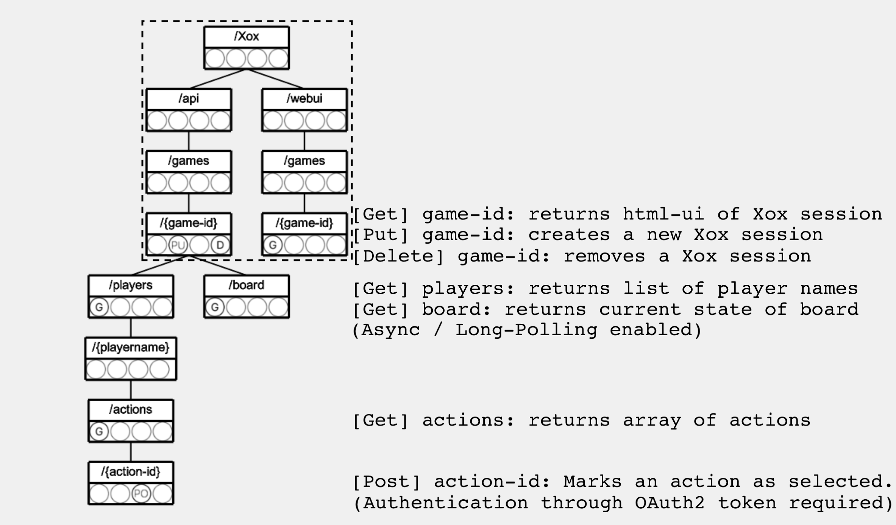

# Xox

A [Lobby-Service](https://github.com/kartoffelquadrat/LobbyService) compatible implementation of *Tic Tac Toe*.

## About

This repository contains the sources of an inofficial LobbyService demo Game.  

 > **Xox is an optional component for a LS-centrist Micro-Service Architecture. It serves as sample project for game developers.**

Key features of this implementation are:

 * Registration at the Lobby-Service on power-up / un-registration on shutdow.
 * No dedicated user management. Users are identified via the Lobby-Service, which acts as Single-Sign-On. Token verification is delegated to the LS, whenever user authentication is required.
 * Dynamic maintenance of parallel game sessions at runtime, accessible through [contractually stipulated REST endpoints](https://github.com/kartoffelquadrat/LobbyService/blob/master/markdown/game-dev.md#callbacks).
 * A self-hosted web-interface, strictly limited to game-specific functionality.

### Architecture

Xox is split into a RESTful API backend and a Web-Interface.

 * The web UI is based on an [existing open source implementation](https://github.com/angle943/tic-tac-toe).
 * The API backend is coded in Spring Boot and exposes the following resources:  
(Dashed box highlights the endpoints stipulated by the Lobby-Service)  


## Setup

Xox requires a dedicated admin account initiated at the LS. This account is not present by default. Default credentials are:

 * Username: ```Xox```
 * Password: ```laaPhie*aiN0```

This repository ~~integrates as an optional git submodule into the LobbyService sources~~ and ~~comes with a preconfigured docker-compose file for simulatenous startup~~.

### IntelliJ Run configurations:

 * JUNIT / Coverage:    
 * Mvn Test: clean test
 * Mvn Run: clean spring-boot:run
  * Spring Boot Run:

### Native Deploment

This first option 

 * Clone this repository
 * Power the service up:  
```mvn exec:spring-boot```
 * Shut the serivce down (implicitly unregisters the game at the LS). Type ```enter```.

### Docker Compose

This second option allows an automated container-based power up with the Lobby-Service Microservice architecture.

 > Not yet supported!


## Usage

*Xox* can not be used as standalone, you need the LobbyService to start new sessions and provide user authentication. *Xox* does not provide a dedicated UI for that, it can therefore only be used in combination with the [*Lobby Service Web Interface*](https://github.com/kartoffelquadrat/LobbyServiceWebInterface).

 * All access to the web-ui requires login.
   * Administrators are directly forwarded to an administration panel. That allows manipulation of user data.
   * Users are forwarded to a game lobby that allows creation and participation in game sessions.

## Contact / Pull Requests

Contact information for bug reports and pull requests:

 * Author: Maximilian Schiedermeier 
 * Github: [Kartoffelquadrat](https://github.com/kartoffelquadrat)
 * Webpage: [McGill University, School of Computer Science](https://www.cs.mcgill.ca/~mschie3)
 * License: [CC BY-NC-SA 4.0](https://creativecommons.org/licenses/by-nc-sa/4.0/)

